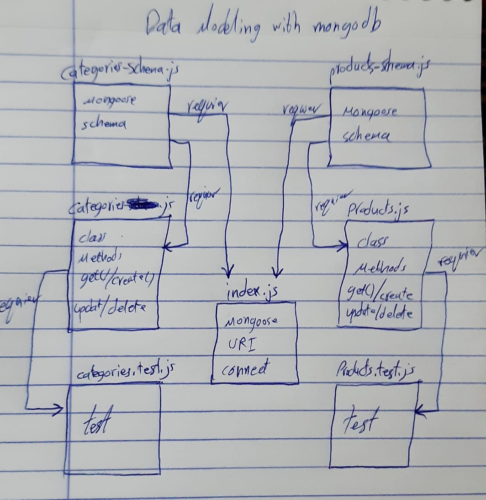

# Data Modeling With NoSQL Databases

# LAB - Class 05

### Author: Ahmad Sawalqeh

### Links and Resources

- [submission PR](https://github.com/Ahmad-Sawalqeh/Data-Modeling-NoSQL-DB/pull/1)
- [ci/cd](https://github.com/Ahmad-Sawalqeh/Data-Modeling-NoSQL-DB/runs/424175973?check_suite_focus=true) (GitHub Actions)

### Setup
run `npm i`

#### How to initialize/run your application (where applicable)
run `npm test` to check all test.

#### Tests

- How do you run tests? 
  run `npm test`

## UML

